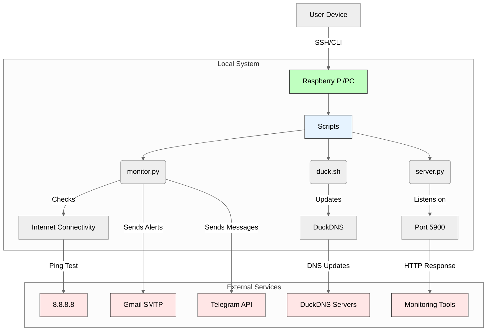

# Raspberry Pi Internet Monitoring System - Installation Guide

This project monitors internet connectivity using two main scripts on a Raspberry Pi running Raspbian OS. It sends notifications via email and Telegram when internet connectivity is restored.

**Note:**
These services can be ported to any Linux, macOS, or Windows operating system as long as Python 3 and Bash are supported. This means you are not limited to Raspberry Pi or Raspberry Pi OS. Simply ensure you have Python 3 and Bash installed on your system, and follow the relevant steps for your platform[^1].

# Table of Contents

1. [Scripts Overview](#scripts-overview)
2. [Pre-reqs](#pre-reqs)
3. [Architeture](#architeture)
3. [Initial Setup](#initial-setup)

4. [DuckDNS Configuration](#duckdns-configuration)
5. [Telegram Bot Setup](#telegram-bot-setup)
6. [Gmail App Key Configuration](#gmail-app-key-configuration)
1. [Installation Guide](#installation-guide)

2. [Script Configuration](#script-configuration)

3. [duck.sh](#duck-sh)
4. [monitor.py](#monitor-py)
5. [server.py](#server-py)
1. [Systemd Service Installation](#systemd-service-installation)
2. [Validation](#validation)
1. [Troubleshooting](#troubleshooting)

# Scripts Overview <a name="scripts-overview"></a>

- **monitor.py**: Checks internet connectivity and sends notifications via email and Telegram when the internet is restored.
- **server.py**: Simulates an HTTP server that listens for connections and responds with **"It's Alive!"**.
- **duck.sh**: Updates DuckDNS URL for dynamic DNS service.


# Pre-reqs <a name="pre-reqs"></a>

- Any Linux, macOS, or Windows system with Python 3 and Bash installed
- Active internet connection
- Terminal access (SSH, command prompt, or direct)

# Architeture <a name="architeture"></a>
Here's a Mermaid diagram showing the system architecture (compatible with Markdown viewers that support Mermaid):



**Architecture Explanation:**

1. **Core Components (Green):**
    - Raspberry Pi/PC acts as the central hub
    - Runs three main scripts in Python/Bash
2. **Monitoring System (Blue):**
    - `monitor.py`: Active checker with dual alerting
    - `server.py`: Passive HTTP endpoint for verification
    - `duck.sh`: DNS maintenance utility
3. **External Dependencies (Red):**
    - **Google DNS (8.8.8.8):** Primary connectivity check
    - **Gmail SMTP:** Email notification channel
    - **Telegram API:** Instant messaging alerts
    - **DuckDNS:** Dynamic DNS updater
    - **Monitoring Tools:** Optional external observers

**Data Flow:**

1. Continuous internet checks (every 60s)
2. Bi-directional communication with cloud services
3. Automated DNS updates (every 5m)
4. Multi-channel alert system activation
5. Passive HTTP health checks

Would you like me to create a more detailed sequence diagram showing the exact workflow between components?

# Initial Setup <a name="initial-setup"></a>

1. Update system packages:

```bash
sudo apt update && sudo apt upgrade -y
```

2. Install required packages:

```bash
sudo apt install -y python3-pip python3-venv curl
```

3. Install the necessary Python libraries:

```bash
pip install requests
```

4. Clone the git repository:

```bash
git clone https://github.com/ucosta/rpi-internet-monitoring.git
```

5. Set up Python virtual environment:

```bash
python3 -m venv venv
source venv/bin/activate
pip install requests
```


## DuckDNS Configuration <a name="duckdns-configuration"></a>

1. Sign up at www.duckdns.org
2. Create a subdomain (e.g., `myraspberry.duckdns.org`)
3. Note your API token from the DuckDNS page

## Telegram Bot Setup <a name="telegram-bot-setup"></a>

1. In Telegram, search for and start a chat with [@BotFather](https://telegram.me/BotFather)
2. Send `/newbot` and follow prompts to create your bot
3. Note the bot token (format: `123456789:ABCdefGHIjklMNopqRSTuvwxyz`)
4. Send `/setjoingroups <NAME OF YOUR GROUP>`
5. You'll be prompted to **Choose a bot to change group membership settings.** so you should send the bot name (in format `@<BOTNAME_bot>`)
6. The return message should be: **Current status is: ENABLED**

```log
'Enable' - bot can be added to groups.
'Disable' - block group invitations, the bot can't be added to groups.
Current status is: ENABLED
```

7. Add your bot to a group chat
8. Get the group chat ID by:
    - Add [@RawDataBot](https://telegram.me/rawdatabot) to the group
    - It will display the chat ID (format: `-123456789`)

## Gmail App Key Configuration <a name="gmail-app-key-configuration"></a>

1. Create an App Password:
2. Go to your [Google Account](https://myaccount.google.com/) -> Security -> App passwords.
3. Generate an app password for "Mail".
4. Note the API secret (format: `ABCdefGHIjklMNopqRSTuvwxyz`)

# Installation Guide <a name="installation-guide"></a>

Follow these steps to set up the monitoring system.

## Script Configuration <a name="script-configuration"></a>

### duck.sh <a name="duck-sh"></a>

1. Edit the `duck.sh` with the following content and update <USER> and <TOKEN> with your DuckDNS credentials.
2. Save the changes.
3. Make the script executable:

```bash
chmod +x duck.sh
```

4. Run the script:

```bash
bash ~/internet-monitor/duck.sh
```

5. Check if the DNS has been updated:

```bash
dig <USER>.duckdns.org
```

6. It should return your internet IP (to get your external IP run `curl https://ipv4.myip.wtf`)

```log
id 30053
opcode QUERY
rcode NOERROR
flags QR RD RA
;QUESTION
<USER>.duckdns.org. IN A
;ANSWER
<USER>.duckdns.org. 60 IN A <YOUR IP>
;AUTHORITY
;ADDITIONAL
```

7. Create a cronjob to set up DuckDNS updates every 5 minutes, changing the `<PATH>` to the location where you cloned the Git Repo:

```bash
(crontab -l 2>/dev/null; echo "*/5 * * * * <PATH>/internet-monitor/duck.sh >> <PATH>/duckdns.log 2>&1") | crontab -
```


### monitor.py <a name="monitor-py"></a>

1. Edit the `monitor.py` with the following content (update credentials):
    - Replace `<TELEGRAM BOT_FATHER TOKEN>` and `<TELEGRAM GROUP ID>`.
    - Replace `<EMAIL>` and `<APP PASSWORD>` with your Gmail and app password.

```python
# Email Configuration
FROM_EMAIL = "<EMAIL>"
PASSWORD = "<APP PASSWORD>"
TO_EMAIL = "<EMAIL>"
SMTP_SERVER = "smtp.gmail.com"
SMTP_PORT = 587

# Telegram Configuration
TELEGRAM_TOKEN = '<TELEGRAM BOT_FATHER TOKEN>'
GROUP_CHAT_ID = '<TELEGRAM GROUP ID>'

# [Rest of the monitor.py content...]
```

2. Save the changes.
3. Make the script executable:

```bash
chmod +x monitor.py
```


### server.py  <a name="server-py"></a>

1. Edit the `server.py` with the following content:
    - Replace `<PORT>` for the port number you want to be opened.

```python
import socket

# Server configuration
HOST = '0.0.0.0'  # Listen on all available network interfaces
PORT = <PORT>     # Port to listen on

# [Rest of the server.py content...]
```

2. Save the changes.
3. Make the script executable:

```bash
chmod +x server.py
```


## Systemd Service Installation  <a name="systemd-service-installation"></a>

1. Create service files:

- internet-monitor.service:

```ini
[Unit]
Description=Internet Monitor
After=network.target

[Service]
ExecStart=<PATH>/internet-monitor/venv/bin/python3 <PATH>/internet-monitor/monitor.py
WorkingDirectory=<PATH>/internet-monitor
Restart=always
RestartSec=5s
```

- http-response.service

```ini
[Unit]
Description=HTTP Response Service
After=network.target

[Service]
ExecStart=<PATH>/venv/bin/python3 <PATH>/internet-monitor/server.py
WorkingDirectory=<PATH>/internet-monitor
Restart=always
RestartSec=5s

[Install]
WantedBy=multi-user.target
```


2. Copy the service files to `/etc/systemd/system/`

```bash
sudo cp *.service /etc/systemd/system/
```

3. Reload the systemctl daemon and start the services

```bash
sudo systemctl daemon-reload
sudo systemctl enable internet-monitor.service http-response.service
sudo systemctl start internet-monitor.service http-response.service
```


## Validation  <a name="validation"></a>

1. Check service status:

```bash
sudo systemctl status internet-monitor.service http-response.service
```

2. Test HTTP server:

```bash
curl http://localhost:5900
# Should return "It's Alive!"
```

3. Check logs:

```bash
journalctl -u internet-monitor.service -f
tail -f ~/internet_monitor.log
```


# Troubleshooting  <a name="troubleshooting"></a>

1. Email Notifications Not Working
    - Verify Gmail app password is correct
    - Check that app access is enabled
    - Review logs: `journalctl -u internet-monitor.service`
2. Telegram Messages Not Arriving
    - Confirm bot token and chat ID are correct
    - Ensure bot was added to the group
    - Check bot privacy settings in [@BotFather](https://telegram.me/BotFather)
3. DuckDNS Not Updating
    - Verify script has execute permissions
    - Check cron is running: `systemctl status cron`
    - Test script manually: `./duck.sh`
    - Check the duck.log

```bash
cat duck.log
```

    - The file will store the last attempt if it was successful or not (OK or KO).
    - If it is KO, check your Token and Domain are correct in the `duck.sh` script
4. Service Failing to Start
    - Check paths in service files are correct
    - Verify Python virtual environment is properly set up
    - Examine logs: `journalctl -u service-name.service`

